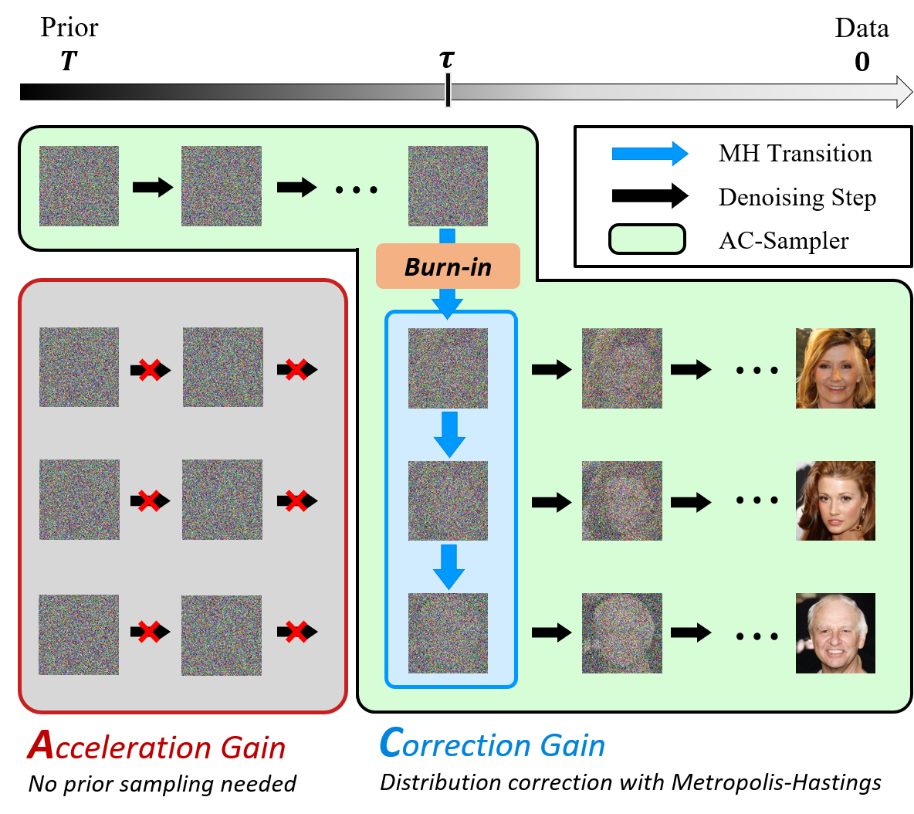

# AC-Sampler: Accelerate And Correct Diffusion Sampling with Metropolis-Hastings Algorithm (AC-Sampler) (ICLR 2026)

----

This repository contains the official implementation of **"AC-Sampler: Accelerate And Correct Diffusion Sampling with Metropolis-Hastings Algorithm"** in [ICLR 2026](https://iclr.cc/Conferences/2026).

[Minsang Park](https://sites.google.com/view/minsang-park/home)$^1$, [Gyuwon Sim](https://aai.kaist.ac.kr/bbs/board.php?bo_table=sub2_1&wr_id=27)$^1$, [Hyeongho Na](https://sites.google.com/view/asd-lab)$^2$, [Jiseok Kwak]()$^1$, [Sumin Lee](https://aai.kaist.ac.kr/bbs/board.php?bo_table=sub2_1&wr_id=18)$^1$, [Richard Lee Kim](https://aai.kaist.ac.kr/bbs/board.php?bo_table=sub2_1&wr_id=31)$^1$, [Donghyeok Shin](https://sdh0818.github.io/)$^1$, [Byeonghu Na](https://sites.google.com/view/byeonghu-na)$^1$, [Yeongmin Kim](https://sites.google.com/view/yeongmin-space/)$^1$, and [Il-Chul Moon](https://aai.kaist.ac.kr/bbs/board.php?bo_table=sub2_1&wr_id=3)$^{1,3}$

**KAIST**$^1$, **UNIST**$^2$, **summary.ai**$^3$

----

----

To be updated
