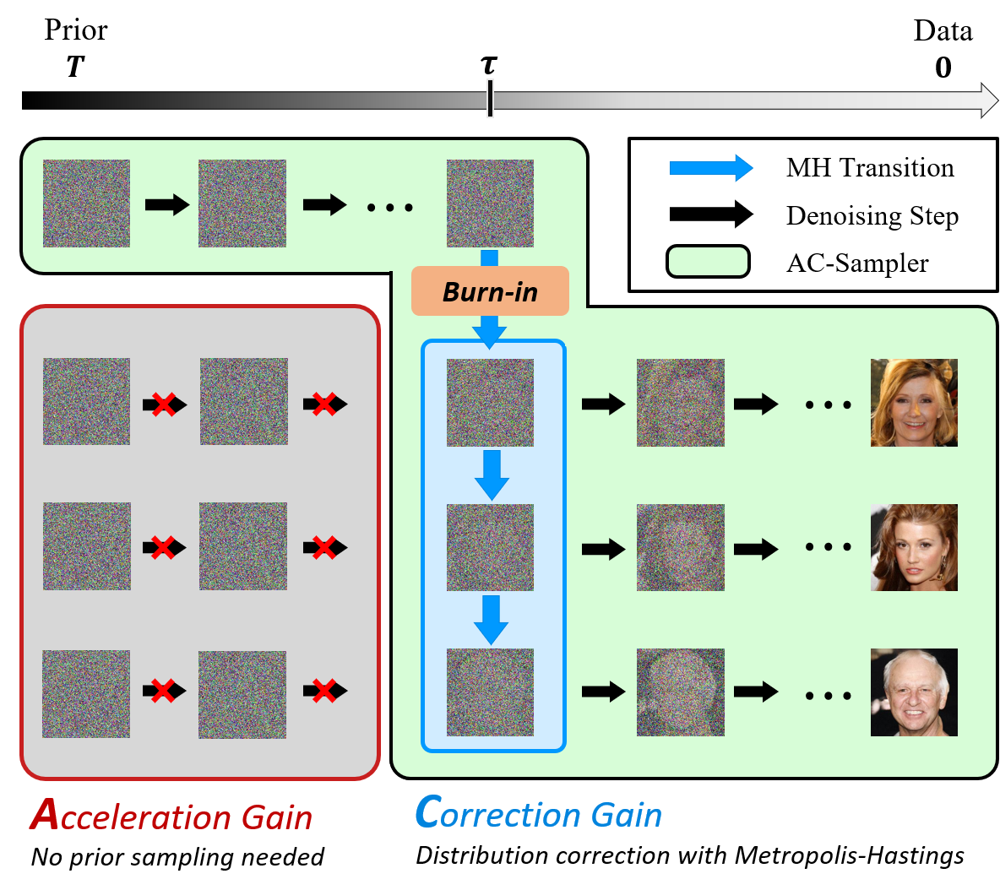

# AC-Sampler: Accelerate And Correct Diffusion Sampling with Metropolis-Hastings Algorithm (ICLR 2026)

----

This repository contains the official PyTorch implementation of **"AC-Sampler: Accelerate And Correct Diffusion Sampling with Metropolis-Hastings Algorithm"** in [**ICLR 2026**](https://iclr.cc/Conferences/2026). | [**OpenReview**](https://openreview.net/forum?id=kWl13kRJTQ) |

[**Minsang Park**](https://sites.google.com/view/minsang-park/home)$^1$, [**Gyuwon Sim**](https://aai.kaist.ac.kr/bbs/board.php?bo_table=sub2_1&wr_id=27)$^1$, [**Hyeongho Na**](https://sites.google.com/view/asd-lab)$^2$, [**Jiseok Kwak**](https://aai.kaist.ac.kr/bbs/board.php?bo_table=sub2_1&wr_id=26)$^1$, [**Sumin Lee**](https://aai.kaist.ac.kr/bbs/board.php?bo_table=sub2_1&wr_id=18)$^1$, [**Richard Lee Kim**](https://aai.kaist.ac.kr/bbs/board.php?bo_table=sub2_1&wr_id=31)$^1$, [**Donghyeok Shin**](https://sdh0818.github.io/)$^1$, [**Byeonghu Na**](https://sites.google.com/view/byeonghu-na)$^1$, [**Yeongmin Kim**](https://sites.google.com/view/yeongmin-space/)$^1$, and [**Il-Chul Moon**](https://aai.kaist.ac.kr/bbs/board.php?bo_table=sub2_1&wr_id=3)$^{1,3}$

**KAIST**$^1$, **UNIST**$^2$, **summary.ai**$^3$

----



----

This release covers the **CIFAR-10** experiments. AC-Sampler runs Metropolis-adjusted Langevin chains at intermediate noise levels of a pre-trained diffusion model. A time-dependent discriminator estimates the density ratio between the data and model marginals, and this ratio enters the Metropolis-Hastings acceptance step so that the chain corrects the generated marginal toward the data marginal. Accepted chain states are denoised to `t = 0` as additional trajectories, so many samples share the early (expensive) denoising steps and the average NFE per sample drops below that of the base sampler.

The code is built on [EDM](https://github.com/NVlabs/edm), [DG](https://github.com/aailabkaist/DG), and [DiffRS](https://github.com/aailabkaist/DiffRS).

## Overview

Let $`\mathbf{s}^{\theta}(\mathbf{x}_t, t) \approx \nabla_{\mathbf{x}_t}\log q_t(\mathbf{x}_t)`$ be the pre-trained score network and $`d^{\phi}(\mathbf{x}_t, t)`$ a time-dependent discriminator trained to separate the data marginal $`q_t`$ from the model marginal $`p^{\theta}_t`$. The discriminator gives the likelihood ratio

```math
L^{\phi}_t(\mathbf{x}_t, t) := \frac{d^{\phi}(\mathbf{x}_t, t)}{1 - d^{\phi}(\mathbf{x}_t, t)} \approx \frac{q_t(\mathbf{x}_t)}{p^{\theta}_t(\mathbf{x}_t)} .
```

AC-Sampler (Sec. 4 of the paper) works in three stages: (i) denoise from the prior down to a target timestep $`\tau`$ with the base sampler; (ii) run a Metropolis-adjusted Langevin (MALA) chain at $`\tau`$ (Algorithm 1, `MALAOneStep`); (iii) denoise every accepted sample from $`\tau`$ to $`0`$. Samples of a chain share stage (i) (*Acceleration Gain*) and the MH correction moves them toward $`q_\tau`$ (*Correction Gain*).

**Proposal (Eq. 5).** MALA with the pre-trained score, with the step size $`\eta`$ set from a target signal-to-noise ratio (Eq. 68):

```math
p^{\theta}_{\text{proposal},t}(\cdot \mid \mathbf{x}_t) = \mathcal{N}\!\left(\mathbf{x}_t + \tfrac{\eta}{2}\,\mathbf{s}^{\theta}(\mathbf{x}_t, t),\ \eta\mathbf{I}\right),
\qquad
\sqrt{\eta} = \mathrm{SNR}\times\frac{2\,\lVert\boldsymbol{\epsilon}\rVert}{\lVert\mathbf{s}\rVert}.
```

**Acceptance probability (Eq. 9).** With $`\hat{\mathbf{x}}_{t-1} := \tfrac{1}{2}\big(\mu_t(\mathbf{x}_t, \mathbf{s}) + \mu_t(\tilde{\mathbf{x}}_t, \tilde{\mathbf{s}})\big)`$, the ratio $`q_t(\tilde{\mathbf{x}}_t)/q_t(\mathbf{x}_t)`$ becomes tractable and

```math
\hat\alpha(\mathbf{x}_t, \tilde{\mathbf{x}}_t, \mathbf{s}, \tilde{\mathbf{s}}, L, \tilde{L})
= \min\!\left(1,\
\underbrace{\frac{q_{t|t-1}(\tilde{\mathbf{x}}_t \mid \hat{\mathbf{x}}_{t-1})}{q_{t|t-1}(\mathbf{x}_t \mid \hat{\mathbf{x}}_{t-1})}}_{\text{Forward term}}
\cdot
\underbrace{\frac{\tilde{L}}{L}}_{\text{Likelihood ratio}}
\cdot
\underbrace{\frac{p^{\theta}_{\text{proposal},t}(\mathbf{x}_t \mid \tilde{\mathbf{x}}_t)}{p^{\theta}_{\text{proposal},t}(\tilde{\mathbf{x}}_t \mid \mathbf{x}_t)}}_{\text{Proposal term}}
\right),
```

where $`\mathbf{s}, \tilde{\mathbf{s}}, L, \tilde{L}`$ denote $`\mathbf{s}^{\theta}(\mathbf{x}_t,t)`$, $`\mathbf{s}^{\theta}(\tilde{\mathbf{x}}_t,t)`$, $`L^{\phi}_t(\mathbf{x}_t,t)`$, $`L^{\phi}_t(\tilde{\mathbf{x}}_t,t)`$. Algorithm 1 follows a propose-until-accept design: proposals are redrawn until one is accepted and only accepted samples are recorded.

Correspondence between the paper's hyper-parameters and the options of `generate_ac_sampler.py`:

| Paper | Code | Notes |
| --- | --- | --- |
| $`T`$ | `--steps` | Number of base-sampler (EDM Heun) steps. |
| $`\tau`$ | `--branch_time` $`= T - \tau`$ | Denoising steps taken before the chain starts; comma-separated list allowed. |
| SNR | `--snr` | Controls the Langevin step size $`\eta`$ (Eq. 68). |
| $`n_{\text{burn-in}}`$ | `--burn_in` | Accepted states discarded at the start of each chain. |
| $`n_{\text{skip}}`$ | `--num_skip` | Keep every $`(n_{\text{skip}} + 1)`$-th accepted state. |
| $`n_{\text{chain}}`$ | `--num_samples_branch` | Chain length, i.e. samples per initial point (one value per `--branch_time`). |
| $`\mathrm{DG}_p`$ | `--dg_proposal` | Discriminator-guided proposal (Appendix, Table 16). |

Running without `--branch_time` reproduces the vanilla EDM sampler, which is the baseline and the source of generated data for discriminator training.

## Requirements

Tested with Python 3.8, PyTorch 1.12.1, CUDA 11.3.

```bash
conda env create -f environment.yml
conda activate ac_sampler
# or
pip install -r requirements.txt
```

`tensorflow` is required only for `evaluations/evaluator.py` (Precision / Recall / Inception Score).

## Checkpoints and data

Place the following files under `checkpoints/` and `data/` (they are not tracked by git).

| File | Source |
| --- | --- |
| `checkpoints/pretrained_score/edm-cifar10-32x32-uncond-vp.pkl` | [EDM](https://github.com/NVlabs/edm) pre-trained score network |
| `checkpoints/ADM_classifier/32x32_classifier.pt` | [DG](https://github.com/aailabkaist/DG) (noise-conditioned ADM classifier used as a feature extractor) |
| `checkpoints/discriminator/cifar_uncond/discriminator_60.pt` | [DG](https://github.com/aailabkaist/DG), or train your own (Step 2) |
| `data/cifar10-32x32.npz` | [EDM FID reference statistics](https://nvlabs-fi-cdn.nvidia.com/edm/fid-refs/cifar10-32x32.npz) |
| `data/true_data.npz` | CIFAR-10 training images as uint8 `(50000, 32, 32, 3)` (from DG). Only needed for discriminator training |

## Step 1. Baseline EDM samples

```bash
python generate_ac_sampler.py \
    --network=checkpoints/pretrained_score/edm-cifar10-32x32-uncond-vp.pkl \
    --discriminator_ckpt=checkpoints/discriminator/cifar_uncond/discriminator_60.pt \
    --outdir=samples/cifar10/edm_base --num_samples=50000
```

Samples are written as `samples_<i>.npz` (key `samples`, uint8 NHWC, 100 images per file) together with a preview grid `sample_<i>.png`. NFE statistics are written to `nfe_analysis.json`.

## Step 2. (Optional) Train the discriminator

The discriminator separates noisy real images from noisy generated images at random diffusion times. Use the baseline samples from Step 1 as the generated set.

```bash
python train.py \
    --savedir=checkpoints/discriminator/cifar_uncond \
    --gendir=samples/cifar10/edm_base \
    --datadir=data/true_data.npz \
    --epoch=60
```

## Step 3. AC-Sampler

Configurations from Table 21 of the paper (unconditional CIFAR-10, EDM + Heun). Remember `--branch_time` $`= T - \tau`$.

| $`T`$ | SNR | $`n_{\text{chain}}`$ | $`n_{\text{burn-in}}`$ | $`n_{\text{skip}}`$ | $`\tau`$ | FID | NFE | Command flags |
| --- | --- | --- | --- | --- | --- | --- | --- | --- |
| 18 | 0.23 | 300 | 10 | 0 | 13 | 1.97 | 26.19 | `--steps=18 --branch_time=5 --num_samples_branch=300 --snr=0.23 --burn_in=10` |
| 18 | 0.23 | 50 | 10 | 0 | 11 | 2.10 | 22.78 | `--steps=18 --branch_time=7 --num_samples_branch=50 --snr=0.23 --burn_in=10` |
| 14 | 0.2 | 50 | 0 | 0 | 6 | 2.38 | 15.82 | `--steps=14 --branch_time=8 --num_samples_branch=50 --snr=0.2 --burn_in=0` |
| 10 | 0.2 | 11 | 0 | 0 | 5 | 3.24 | 10.57 | `--steps=10 --branch_time=5 --num_samples_branch=11 --snr=0.2 --burn_in=0` |

Example (first row):

```bash
python generate_ac_sampler.py \
    --network=checkpoints/pretrained_score/edm-cifar10-32x32-uncond-vp.pkl \
    --discriminator_ckpt=checkpoints/discriminator/cifar_uncond/discriminator_60.pt \
    --outdir=samples/cifar10/ac_T18_tau13 --num_samples=50000 \
    --steps=18 --branch_time=5 --num_samples_branch=300 --snr=0.23 --burn_in=10
```

Multiple target timesteps can be used at once, e.g. `--branch_time=3,4,5 --num_samples_branch=3,4,5` (Table 21, $`\tau = 15, 14, 13`$). The chain stops branching automatically once enough samples are queued to reach `--num_samples`.

Other options:

| Option | Meaning |
| --- | --- |
| `--do_mh` | `0` disables the accept/reject step (plain Langevin). |
| `--dg_proposal` | Weight of discriminator guidance inside the Langevin proposal ($`\mathrm{DG}_p`$). |
| `--dg_weight` | Discriminator guidance on the ODE drift (DG baseline, Kim et al., 2023). |
| `--S_churn`, `--S_min`, `--S_max`, `--S_noise` | EDM stochastic sampler options (unused for CIFAR-10). |

## Step 4. Evaluation

FID (EDM protocol, 50k samples):

```bash
python fid_npzs.py --images=samples/cifar10/ac_T18_tau13 --ref=data/cifar10-32x32.npz
```

Precision / Recall / IS with the ADM evaluation suite:

```bash
python evaluations/merge_npz.py --samples_dir=samples/cifar10/ac_T18_tau13 --num_samples=10000
python evaluations/evaluator.py <reference_batch.npz> samples/cifar10/ac_T18_tau13/samples_merged.npz
```

Average NFE per sample:

```bash
python summarize_nfe.py samples/cifar10/edm_base samples/cifar10/ac_T18_tau13
```

## Repository layout

```
generate_ac_sampler.py   AC-Sampler (also the EDM baseline when no branch is given)
train.py                 Discriminator training
classifier_lib.py        Discriminator loading, log-ratio and VP-SDE utilities
fid_npzs.py              FID computation
summarize_nfe.py         NFE summary from nfe_analysis.json
evaluations/             ADM evaluation suite (Precision / Recall / IS) and npz merge helper
guided_diffusion/        ADM U-Net / classifier architecture (OpenAI)
dnnlib/, torch_utils/    EDM utilities (NVIDIA), required to unpickle EDM networks
```

## Acknowledgements

This code is heavily based on:

* Karras et al., *Elucidating the Design Space of Diffusion-Based Generative Models*, NeurIPS 2022. [code](https://github.com/NVlabs/edm)
* Kim et al., *Refining Generative Process with Discriminator Guidance in Score-based Diffusion Models*, ICML 2023. [code](https://github.com/aailabkaist/DG)
* Na et al., *Diffusion Rejection Sampling*, ICML 2024. [code](https://github.com/aailabkaist/DiffRS)
* Dhariwal & Nichol, *Diffusion Models Beat GANs on Image Synthesis*, NeurIPS 2021. [code](https://github.com/openai/guided-diffusion)

## Citation

```bibtex
@inproceedings{park2026acsampler,
  title     = {{AC-Sampler}: Accelerate And Correct Diffusion Sampling with Metropolis-Hastings Algorithm},
  author    = {Park, Minsang and Sim, Gyuwon and Na, Hyeongho and Kwak, Jiseok and Lee, Sumin and Kim, Richard Lee and Shin, Donghyeok and Na, Byeonghu and Kim, Yeongmin and Moon, Il-Chul},
  booktitle = {International Conference on Learning Representations (ICLR)},
  year      = {2026},
}
```

## License

Code derived from EDM (`generate_ac_sampler.py`, `fid_npzs.py`, `dnnlib/`, `torch_utils/`) is under NVIDIA's [CC BY-NC-SA 4.0](http://creativecommons.org/licenses/by-nc-sa/4.0/) license. The remaining code follows the Apache 2.0 license in `LICENSE`, inherited from DG.
